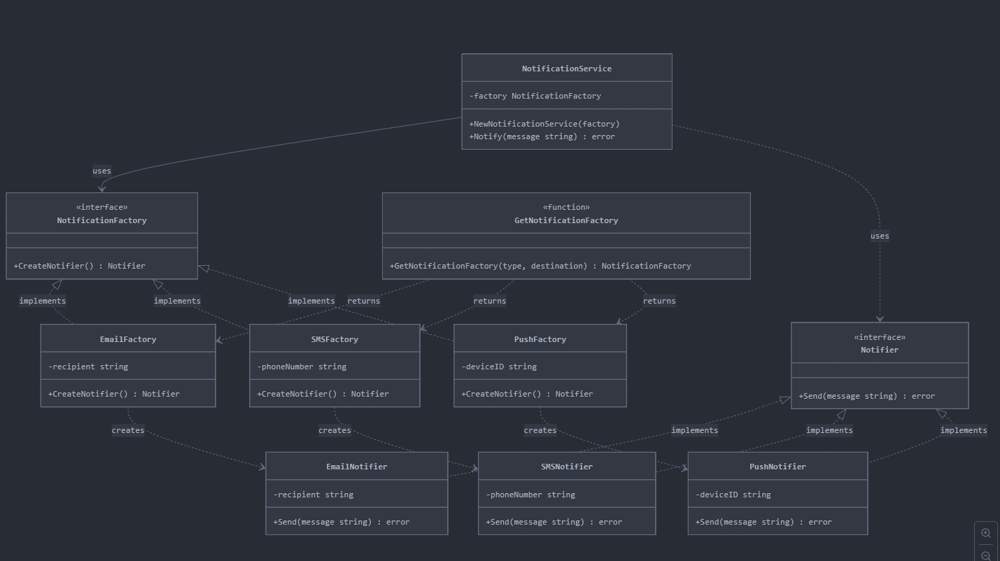

## Factory Method

Factory Method is a creational design pattern that solves the problem of creating 
product objects without specifying their concrete classes.

### Where I can use this pattern?

    * Notification/Messaging Systems

    * Different channels: email, SMS, push, webhooks
      Allows adding new channels without modifying existing code

    * Database Connectors
      MySQL, PostgreSQL, MongoDB, Redis
      Same client code for different implementations

    * Payment Processors
      PayPal, Stripe, credit cards
      Change provider without modifying business logic

    * Document Exporters
      PDF, Excel, CSV, JSON
      Generate reports in different formats

    * Logging Systems
      Console, file, remote service, syslog
      Configure log destinations dynamically

### Factory Method Image example
